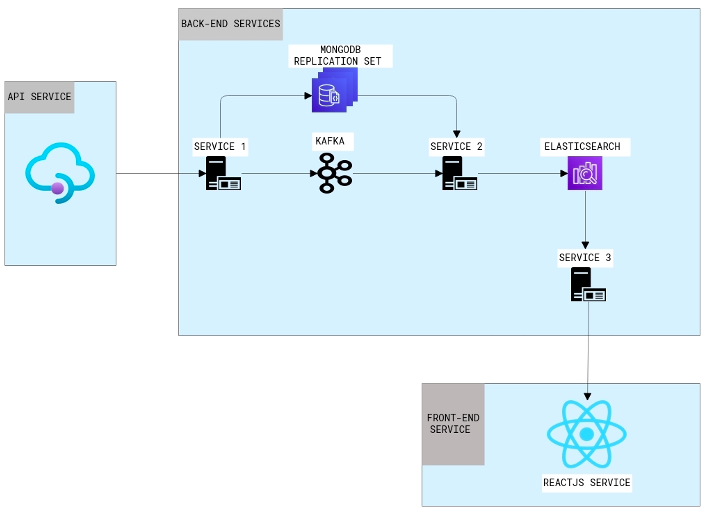
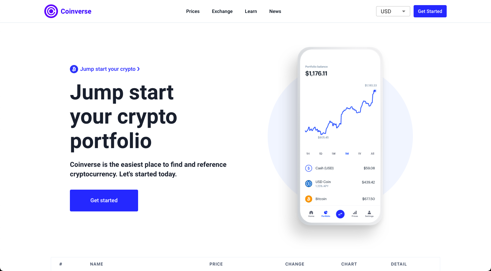
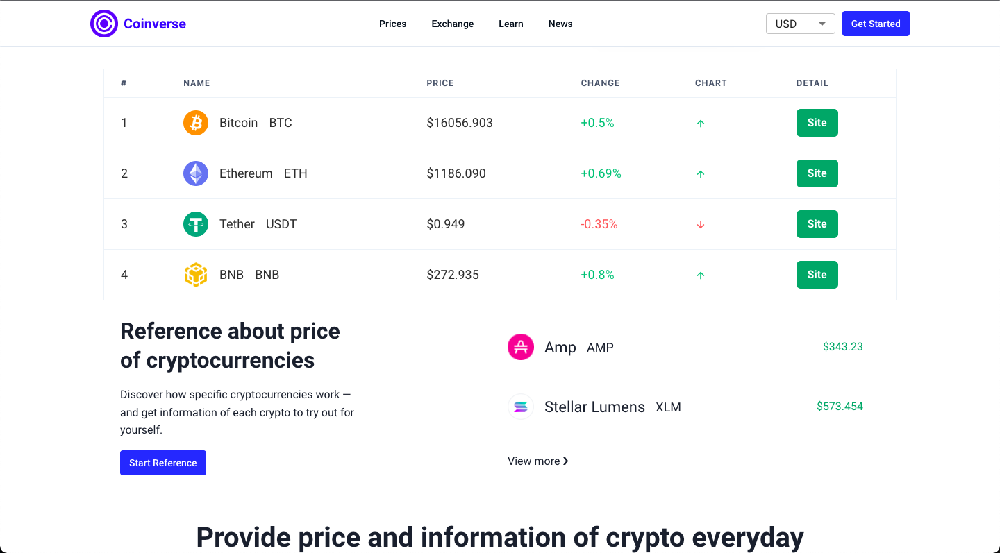
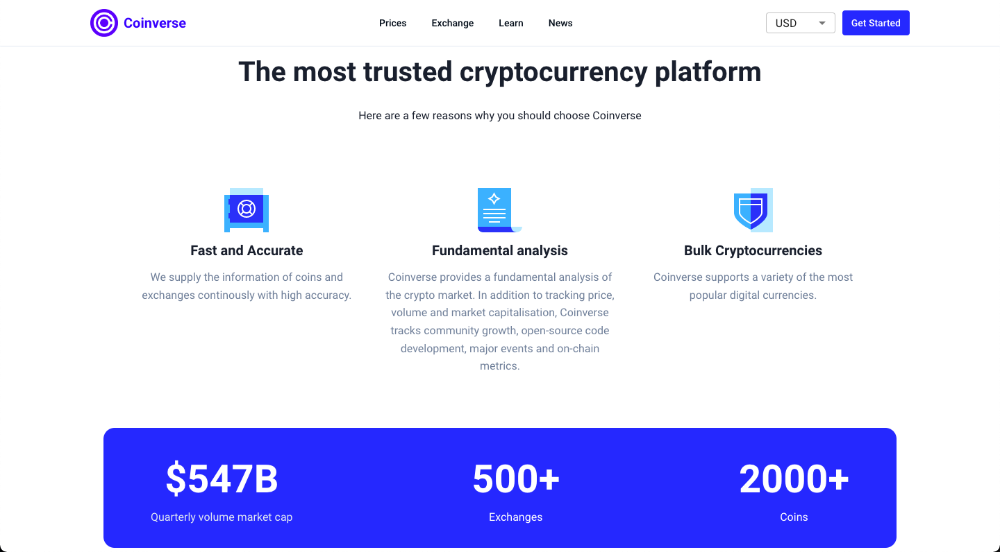
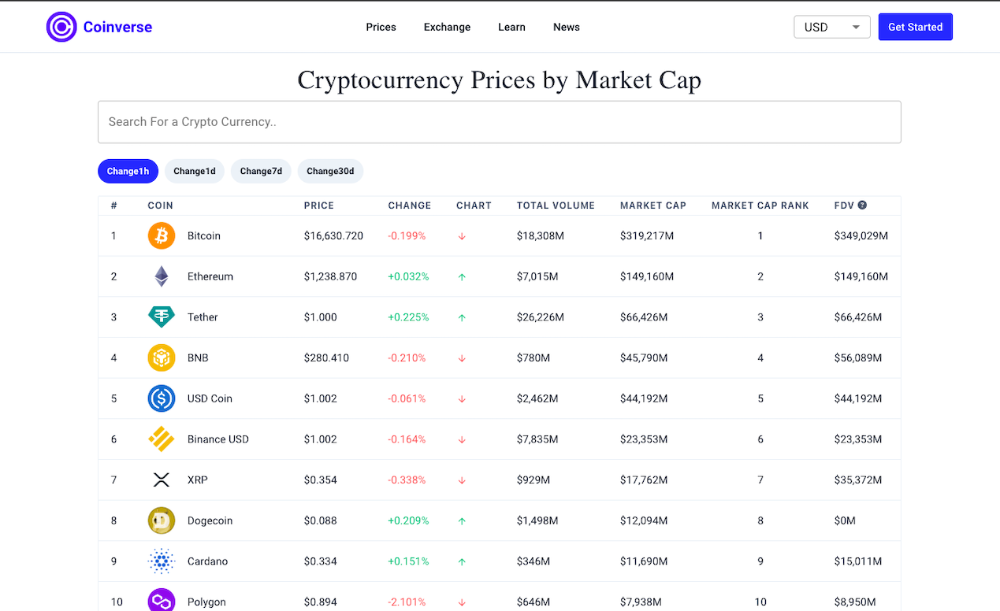
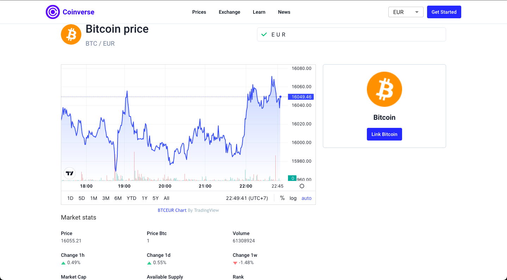
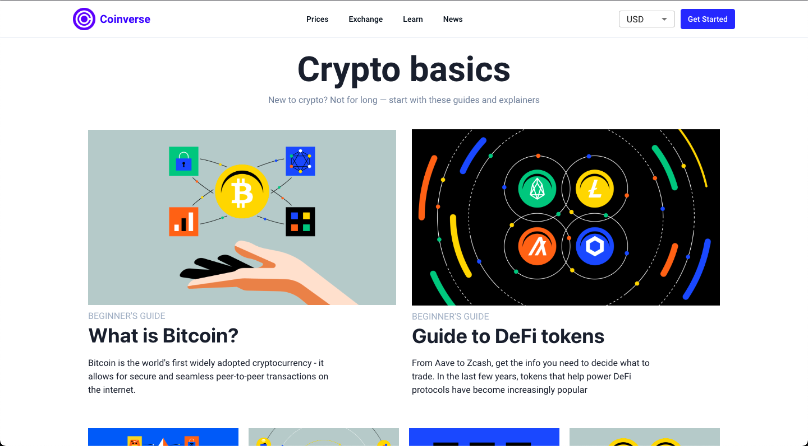
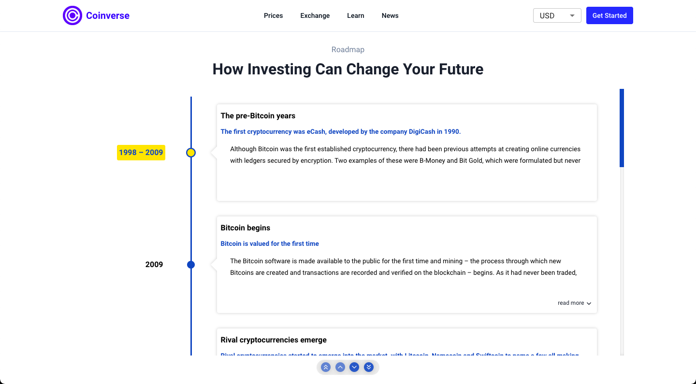
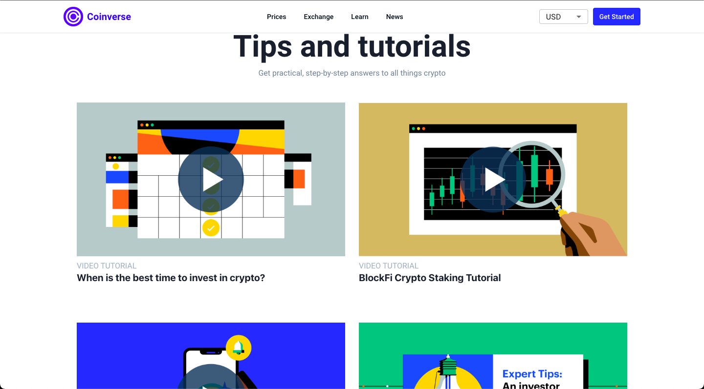

# Coinverse

A software system to collect data of digital currencies by market capitalization

# Table Of Content

# About the project

In this application, it will collect the real-time and historical data of cryptocurrencies by market capitalization

The users can see the whole and details of data about cryptocurrencies.

# About the high level architecture



# **Built With**

### For front-end service

- ReactJS
- Chakra UI

### For back-end service

- Kotlin
- Spring Boot

### Other technologies

- Docker Swarm
- AWS Cloud
- Elasticsearch, Kibana
- Kafka
- MongoDB Replication Set

# **Getting Started**

### **Prerequisites**:

- At least 6 machines (Recommend cloud machine like AWS, Azure, etc)
- Have knowledge about Docker and Docker Swarm

### **Installation**:

1. Clone the repo and change to that folder

```jsx
git clone https://github.com/trongbui1105/coinverse.git
```

1. Install packages for the frontend service

```jsx
cd frontend
npm install
```

1. Set up MongoDB Replication Set on cloud machines (at least 3 nodes)
2. Set up Kafka
3. Set up Elasticsearch & Kibana
4. Change the host & port of these containers in file `[application.properties](http://application.properties)` of each backend  service

### Usage:

1. Run sequence of service in the backend services to collect data.
2. Run the frontend service:

```jsx
cd frontend
npm start
```

# User Interface

- Main page







- Prices page




- Details of coin



- Learning page







- News page

